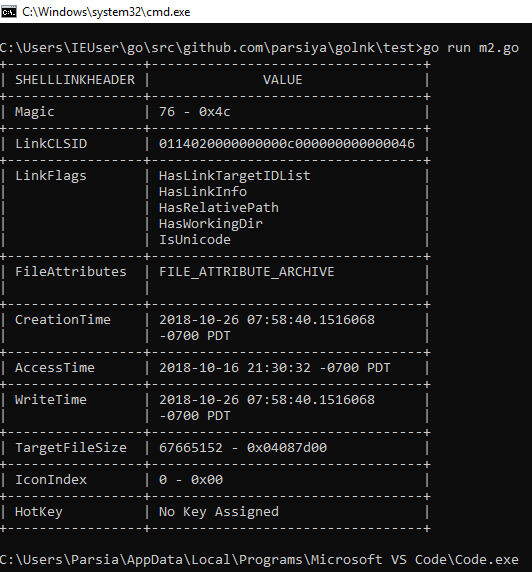
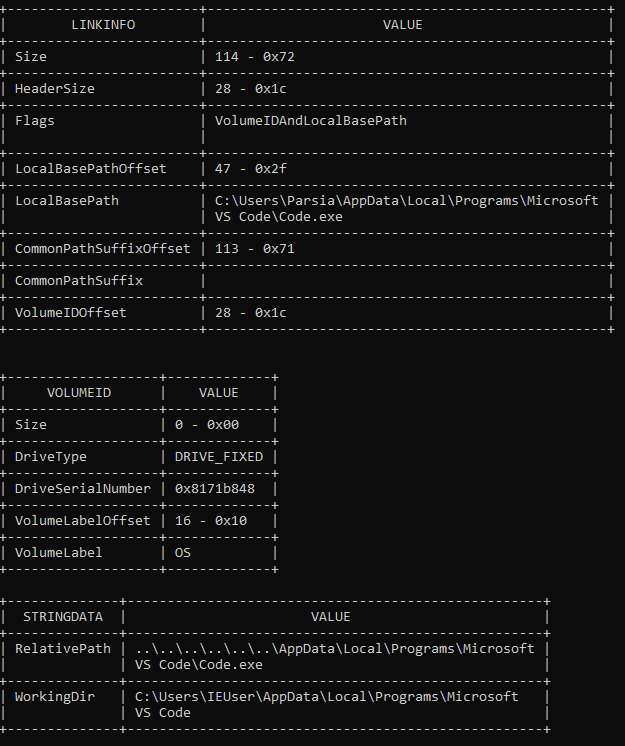
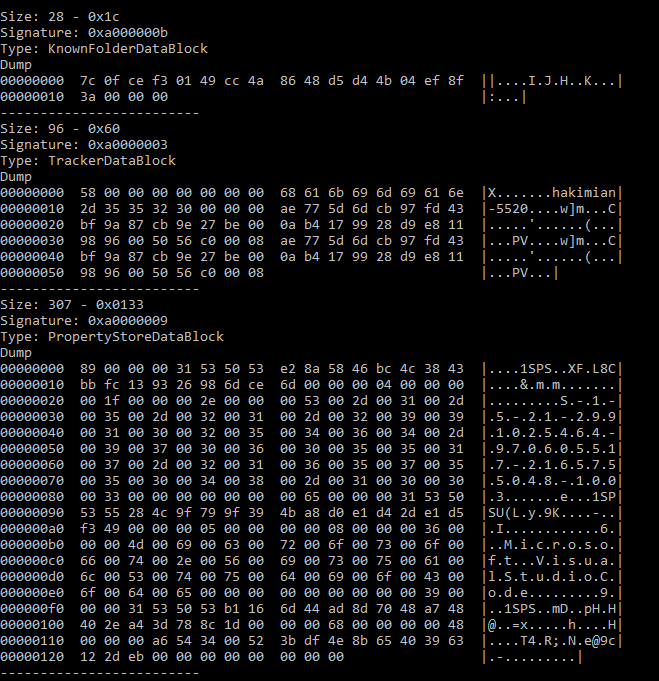

# lnk - lnk Parser for Go
lnk is a package for parsing Windows Shell Link (.lnk) files.

It's based on version 5.0 of the [MS-SHLLINK] document:

* Reference: https://msdn.microsoft.com/en-us/library/dd871305.aspx
* Version 5.0: https://winprotocoldoc.blob.core.windows.net/productionwindowsarchives/MS-SHLLINK/[MS-SHLLINK].pdf

If the lnk file does not adhere to this specification (either corrupted or from an earlier version), it might not be parsed.

## Shell Link Structure
Each file has at least one header (`SHELL_LINK_HEADER`) and one or more optional sections. 

```
SHELL_LINK = SHELL_LINK_HEADER [LINKTARGET_IDLIST] [LINKINFO]
              [STRING_DATA] *EXTRA_DATA
```

The existence of these sections are defined by the `LinkFlags` uint32 in the header (mapped to `HEADER.LinkFlags`). To see all flags, look at `linkFlags` in [header.go](header.go).

Note about size fields: "Unless otherwise specified, the value contained by size fields includes the size of size field itself."

Currently lnk parses every section except `EXTRA_DATA`. Different data blocks are identified and stored but it does not parse any of them other than identifying the type (via their signature) and storing the content. Data blocks are defined in section 2.5 of the specification.

## Setup
Package has only one dependency: https://github.com/olekukonko/tablewriter. It's used to create tables in section stringers.

## Usage
Pass a filename to `lnk.File` or an `io.Reader` with its contents to `lnk.Read`. Both return `LnkFile`:

``` go
type LnkFile struct {
	Header     ShellLinkHeaderSection  // File header.
	IDList     LinkTargetIDListSection // LinkTargetIDList.
	LinkInfo   LinkInfoSection         // LinkInfo.
	StringData StringDataSection       // StringData.
	DataBlocks ExtraDataSection        // ExtraData blocks.
}
```

Each section is a struct that is populated. See their fields in their respective source files.

``` go
package main

import (
	"fmt"

	"github.com/parsiya/golnk"
)

func main() {

	Lnk, err := lnk.File("test.lnk")
	if err != nil {
		panic(err)
	}

	// Print header.
	fmt.Println(Lnk.Header)

	// Path to the target file is usually in LinkInfo.LocalBasePath.
	fmt.Println("BasePath", Lnk.LinkInfo.LocalBasePath)

	// fmt.Println(Lnk.LinkInfo)

	// fmt.Println(Lnk.StringData)

	// fmt.Println(Lnk.DataBlocks)
}
```



Each section has a [Stringer](https://golang.org/pkg/fmt/#Stringer) that prints the fields in a [table](https://github.com/olekukonko/tablewriter).



Extra Data Blocks are not parsed but can be dumped or accessed manually.



**Parse the Windows start menu and extract the base path for all lnk files.**

See [test/parseStartMenu.go](test/parseStartMenu.go):

``` go
package main

import (
	"fmt"
	"os"
	"path/filepath"

	"github.com/parsiya/golnk"
)

// Sample program to parse all lnk files in the "All Users" start menu at
// C:\ProgramData\Microsoft\Windows\Start Menu\Programs.

func main() {
	startMenu := "C:/ProgramData/Microsoft/Windows/Start Menu/Programs"
	basePaths := []string{}
	err := filepath.Walk(startMenu, func(path string, info os.FileInfo, walkErr error) error {
		// Only look for lnk files.
		if filepath.Ext(info.Name()) == ".lnk" {
			f, lnkErr := lnk.File(path)
			// Print errors and move on to the next file.
			if lnkErr != nil {
				fmt.Println(lnkErr)
				return nil
			}
			var targetPath = ""
			if f.LinkInfo.LocalBasePath != "" {
				targetPath = f.LinkInfo.LocalBasePath
			}
			if f.LinkInfo.LocalBasePathUnicode != "" {
				targetPath = f.LinkInfo.LocalBasePathUnicode
			}
			if targetPath != "" {
				fmt.Println("Found", targetPath)
				basePaths = append(basePaths, targetPath)
			}
		}
		return nil
	})
	if err != nil {
		panic(err)
	}

	// Print everything.
	fmt.Println("------------------------")
	for _, p := range basePaths {
		fmt.Println(p)
	}
}
```

## TODO
1. Use `dep`?
2. Identify ExtraDataBlocks.
3. Clean up code.
4. Write more unit tests.
5. Test it on more lnk files.
6. ~~Add a `Data` field to each section and store raw bytes there. Then add a `Dump` method to each section and use `hex.Dump` to dump the raw bytes.~~
